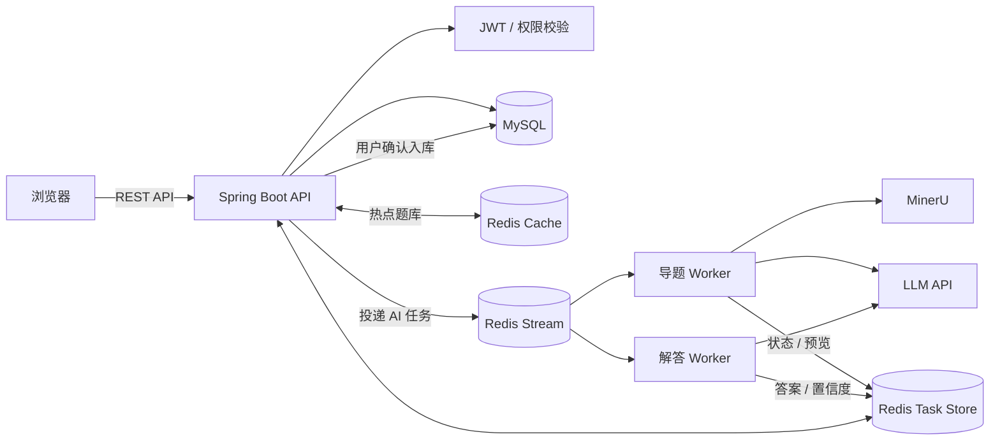
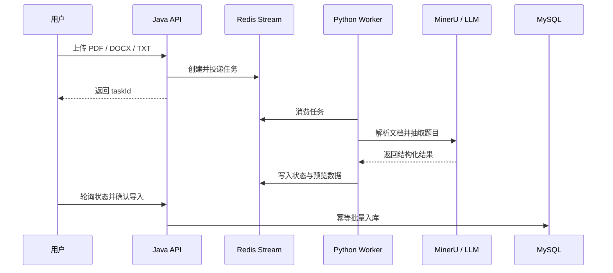

<div align="center">

# iShua

### AI 驱动的智能题库与刷题平台

把 PDF、Word、TXT 中的题目变成可编辑、可练习、可复习的在线题库。

<p>
  <a href="https://ishua.cloud"></a>
  <a href="https://github.com/C1ouDreamW/iShua_backend/actions/workflows/ci.yml"></a>
</p>

<p>
  <a href="https://openjdk.org/"></a>
  <a href="https://spring.io/projects/spring-boot"></a>
  <a href="https://www.mysql.com/"></a>
  <a href="https://redis.io/"></a>
  <a href="https://www.python.org/"></a>
</p>

[在线体验](https://ishua.cloud) · [快速开始](#快速开始) · [API 文档](docs/API.md) · [部署指南](docs/DEPLOYMENT.md)

</div>

---

iShua 面向大学生备考与日常复习场景。当前仓库包含 **Spring Boot 后端 API** 与 **Python AI Worker**：前者负责用户、题库、刷题和错题本等业务，后者通过 MinerU 与 LLM 完成文档解析、题目抽取和智能解答。

## 核心能力

| 能力 | 说明 |
| --- | --- |
| **文档智能导题** | 支持 PDF、DOCX、TXT；异步解析并抽取为标准化题目，预览确认后再批量入库。 |
| **AI 智能解答** | 对缺少答案的客观题进行分片、多轮投票解答，返回答案置信度供用户复核。 |
| **树形题库管理** | 通过 `FOLDER / LEAF` 模型组织任意深度题库，支持公开大厅与个人题库。 |
| **刷题复习闭环** | 支持顺序或随机刷题、服务端判分、错题自动归档与错题重刷。 |
| **异步与缓存** | Redis Stream 解耦耗时 AI 任务；Redis Cache-Aside 加速公开热点题库读取。 |
| **权限与数据隔离** | JWT 登录态、角色权限与资源归属校验共同保护用户数据。 |

## AI 导题演示

<div align="center">

<video controls src="https://github.com/user-attachments/assets/3e4c1bb7-4419-4b02-8250-91ffbd6fa605"></video>

上传文档 → 异步解析 → 题目预览 → 人工确认 → 批量入库

</div>

> 如果视频无法直接播放，可以[点击这里查看演示](https://github.com/user-attachments/assets/3e4c1bb7-4419-4b02-8250-91ffbd6fa605)。

## 系统架构



AI 调用在独立 Worker 中执行，HTTP 请求只负责校验、创建任务与返回 `taskId`。前端轮询任务状态，并在预览页确认结果后再写入正式题库，避免长耗时调用阻塞接口，也降低异常解析结果污染题库的风险。

<details>
<summary><strong>查看 AI 导题时序</strong></summary>



</details>

## 技术栈

| 层级 | 技术 |
| --- | --- |
| API 服务 | Java 17、Spring Boot 3.5、Spring MVC、Spring Validation |
| 数据访问 | MyBatis-Plus、MySQL 8 |
| 异步与缓存 | Redis Stream、Redis Cache-Aside |
| AI Worker | Python 3.10+、MinerU、OpenAI-compatible LLM API |
| 安全与文档 | JWT、BCrypt、Cloudflare Turnstile、SpringDoc OpenAPI |
| 测试与交付 | JUnit 5、H2、Testcontainers、GitHub Actions |

## 快速开始

### 1. 准备环境

- JDK 17+
- MySQL 8.x
- Redis 6.x+
- Python 3.10+（仅 AI 导题与 AI 解答需要）

### 2. 启动 Java API

```bash
git clone https://github.com/C1ouDreamW/iShua_backend.git
cd iShua_backend

# 创建本地开发配置，并按注释填写数据库、Redis、JWT 等信息
cp src/main/resources/application-dev.example.yaml \
   src/main/resources/application-dev.yaml

# 先创建 ishua_backend 数据库，再初始化表结构
mysql -u root -p ishua_backend < sql/schema/init_core_tables.sql

./mvnw spring-boot:run
```

Windows 用户可将 `cp` 替换为 `copy`，并使用 `mvnw.cmd spring-boot:run`。服务启动后访问：

- Swagger UI：<http://localhost:8080/swagger-ui.html>
- OpenAPI JSON：<http://localhost:8080/v3/api-docs>

### 3. 启动 AI Worker（可选）

```bash
cd ai-import-worker
python -m venv .venv

# Linux / macOS
source .venv/bin/activate

pip install -r requirements.txt
cp .env.example .env
# 在 .env 中填写 Redis、MinerU 与 LLM 配置
python main.py
```

Java API 与 Worker 必须连接同一个 Redis，并能访问同一个上传文件目录。Windows 启动方式及完整环境变量请参考[部署指南](docs/DEPLOYMENT.md)。

## 项目结构

```text
.
├── src/main/java/       # Spring Boot 业务代码
├── src/main/resources/  # 应用配置模板
├── ai-import-worker/    # AI 导题与 AI 解答 Worker
├── sql/schema/          # 数据库初始化脚本
├── src/test/            # 单元测试与集成测试
└── docs/                # API、流程、部署与测试文档
```

| 想了解的内容 | 文档 |
| --- | --- |
| 接口契约与调用方式 | [API 文档](docs/API.md) |
| AI 文档导题链路 | [AI 导题流程](docs/AI_IMPORT_FLOW.md) |
| AI 智能解答链路 | [AI 解答流程](docs/AI_ANSWER_FLOW.md) |
| 本地与生产部署 | [部署指南](docs/DEPLOYMENT.md) |
| 测试策略与运行方式 | [测试指南](docs/TESTING.md) |

## 测试

```bash
./mvnw test
```

提交和 Pull Request 会通过 GitHub Actions 自动运行 Maven 测试。

---

<div align="center">

如果 iShua 对你有帮助，欢迎 Star，或提交 Issue / Pull Request。

</div>
