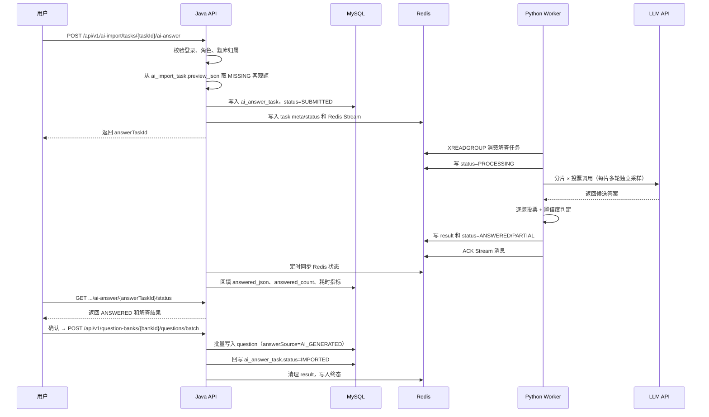

# AI 智能解答流程

iShua 的 AI 解答流程用于在题库文件本身不含答案时，对导题清洗阶段标记为「无答案」的客观题，通过独立 LLM 流程进行解答。核心设计是：HTTP 请求只负责提交解答任务，耗时的分片投票调用由独立 Python Worker 处理，解答结果带置信度回到预览页供用户二次确认，再走现有批量入库接口写入正式题库。解答流程与导题流程物理隔离，使用独立 Redis Stream、独立消费组和独立 Worker 进程，互不影响线上导题链路。

> 解答流程当前仅支持 `SINGLE`、`MULTI`、`JUDGE` 三类客观题；`SHORT_ANSWER` 简答题不进入解答流程，由用户在预览页手填。

## 参与组件

| 组件 | 职责 |
| --- | --- |
| 前端 | 在预览页对无答案客观题触发「AI 解答」、轮询进度、展示解答结果与置信度 |
| Spring Boot API | 校验权限、从导入任务预览中筛选待解答题、创建解答任务、写入 Redis Stream、提供状态与结果查询 |
| Redis Stream | 解耦 Java API 与解答 Worker |
| Python Worker | 消费任务，分片并多次投票调用 LLM，写回状态与解答结果 |
| LLM API | 对单个分片作答，返回候选答案 |
| MySQL | 持久化解答任务、题库、试题数据 |
| Redis | 存放解答任务热状态、解答结果、幂等锁 |

## 主流程



## 状态机


状态说明：

| 状态 | 说明 |
| --- | --- |
| `SUBMITTED` | Java API 已创建解答任务并投递 Stream |
| `PROCESSING` | Worker 正在解答 |
| `ANSWERED` | 全部题目解答成功，等待用户确认 |
| `PARTIAL` | 部分题目解答失败，已成功部分可入库 |
| `FAILED` | 整体失败或任务超时 |
| `IMPORTED` | 用户已确认入库（走现有批量入库接口后回写） |

## 关键接口

### 1. 创建解答任务

```http
POST /api/v1/ai-import/tasks/{taskId}/ai-answer
Content-Type: application/json
Authorization: Bearer <token>
```

请求体支持两种形式，按索引指定或按条件筛选：

```json
{ "questionIndices": [0, 3, 5] }
```

```json
{ "filter": "MISSING" }
```

服务端从对应导入任务的 `preview_json` 中取题，**仅筛选 `SINGLE` / `MULTI` / `JUDGE` 且 `answerSource=MISSING` 的题目**，简答题即使无答案也不会进入解答流程。

权限：

- 最低角色：`PREMIUM`
- 导入任务必须属于当前用户，`ADMIN` 可绕过归属校验。

成功响应中的 `data.answerTaskId` 用于后续轮询和查看结果。

### 2. 轮询解答进度

```http
GET /api/v1/ai-import/tasks/{taskId}/ai-answer/{answerTaskId}/status
Authorization: Bearer <token>
```

状态来源优先级：

1. MySQL `ai_answer_task`
2. Redis `ishua:answer:status:{answerTaskId}`

前端建议：

- `SUBMITTED`、`PROCESSING`：每 2-5 秒轮询。
- `ANSWERED`、`PARTIAL`：停止轮询，展示结果确认页。
- `FAILED`、`IMPORTED`：停止轮询并展示结果。

### 3. 获取解答结果

```http
GET /api/v1/ai-import/tasks/{taskId}/ai-answer/{answerTaskId}/result
Authorization: Bearer <token>
```

返回 `QuestionPreviewVO[]`，其中解答成功的题目：

- `answerSource` = `AI_GENERATED`
- `answerConfidence` = `HIGH` / `MEDIUM` / `LOW`
- `answer` 为投票后的最终答案
- `analysis` 中可能带 `【AI解答·存疑】` 或 `【AI解答·失败】` 标记

LOW 置信度题仍返回答案，前端高亮提醒用户必看，由用户决定是否采用。

### 4. 确认批量导入

入库仍走现有批量入库接口：

```http
POST /api/v1/question-banks/{bankId}/questions/batch
Content-Type: application/json
Authorization: Bearer <token>
```

前端把解答结果合并到原 preview 后提交，服务端落库时 `answer_source` 写为 `AI_GENERATED`，并回写 `ai_answer_task.status=IMPORTED`。

接口具备幂等保护：

- 已经 `IMPORTED` 的解答任务再次提交会返回成功。
- 并发导入同一解答任务会返回 `409`。
- 非 `ANSWERED` / `PARTIAL` 状态不能导入。

## Redis Stream 消息

Java API 将任务元数据序列化后写入：

- Stream：`ishua:answer:stream`
- Consumer group：`ishua-answer-workers`
- 字段：`payload`

任务 payload 必须包含：

| 字段 | 说明 |
| --- | --- |
| `answerTaskId` | 解答业务任务 ID |
| `parentTaskId` | 关联的导入任务 ID |
| `userId` | 提交用户 |
| `bankId` | 目标题库 |
| `questions` | 待解答题目列表（仅客观题，含 `questionType` / `stem` / `options`） |

## Redis Key

| Key | TTL | 说明 |
| --- | --- | --- |
| `ishua:answer:meta:{answerTaskId}` | 1 小时 | 任务元数据 |
| `ishua:answer:status:{answerTaskId}` | 1 小时 | 任务状态 |
| `ishua:answer:result:{answerTaskId}` | 30 分钟 | 解答结果 JSON |
| `ishua:answer:import_lock:{answerTaskId}` | 5 分钟 | 批量入库锁 |
| `ishua:answer:watchdog:lock` | 短 TTL | Watchdog 扫描锁 |

`ai_answer_task` 表是任务可恢复的权威来源。Redis 是热路径缓存，Java 定时任务会把 Worker 写入 Redis 的状态同步回 MySQL。

## Worker 处理步骤

Worker 主循环（`answer_worker.py`，与导题 `worker.py` 独立部署）：

1. 校验 `LLM_API_KEY`。
2. 确保 Redis Stream 消费组 `ishua-answer-workers` 存在。
3. 使用 `XREADGROUP` 读取一条解答任务。
4. 写入 `PROCESSING` 状态。
5. 将题目按 `ANSWER_SHARD_SIZE`（默认 10）分片。
6. 对每个分片并发调用 LLM，每片独立采样 `ANSWER_VOTE_ROUNDS`（默认 3）轮。
7. 逐题投票，按一致性判定 `HIGH` / `MEDIUM` / `LOW` 置信度。
8. 写入 `ishua:answer:result:{answerTaskId}` 和 `ANSWERED` / `PARTIAL` 状态。
9. ACK 当前 Stream 消息。
10. 分片失败不阻塞整批：失败片中题目以 `answer=[]`、`answerSource=MISSING`、analysis 标 `【AI解答·失败】` 返回，其余片正常解答。

Worker 对终态有保护：如果 Java 已经把任务标记为 `IMPORTED`，或 Watchdog 已经标记为 `FAILED`，Worker 不会再覆盖终态。

## 解答算法

### 分片与投票

将待解答题按 `ANSWER_SHARD_SIZE` 切片，每个分片以 `ANSWER_TEMPERATURE`（>0）独立采样 `ANSWER_VOTE_ROUNDS` 轮，再逐题对多轮候选答案投票。可配置参数：

| 环境变量 | 默认值 | 说明 |
| --- | --- | --- |
| `ANSWER_SHARD_SIZE` | `10` | 每片题目数，影响单次 prompt 长度与成本 |
| `ANSWER_VOTE_ROUNDS` | `3` | 每片投票轮数，影响正确率与成本 |
| `ANSWER_TEMPERATURE` | `0.4` | 投票时采样温度，引入多样性 |
| `ANSWER_LLM_MODEL` | 同 `LLM_MODEL` | 解答专用模型，可换更强模型（如 `deepseek-reasoner`） |
| `ANSWER_MAX_CONCURRENCY` | `4` | 分片并发数 |
| `ANSWER_LLM_TIMEOUT_SECONDS` | `120` | 解答 LLM 单次调用超时 |

总调用次数 ≈ `ceil(N / ANSWER_SHARD_SIZE) × ANSWER_VOTE_ROUNDS`，例如 20 题约 6 次调用。

### 置信度判定

| 题型 | HIGH | MEDIUM | LOW |
| --- | --- | --- | --- |
| `SINGLE` / `JUDGE` | 3/3 一致 | 2/3 一致 | 无多数（取众数，analysis 标 `【AI解答·存疑】`） |
| `MULTI` | 全部字母 3/3 出现 | 部分字母 2/3 出现 | 无字母达 2/3（answer 仍取出现≥2 次的，标存疑） |

LOW 置信度题仍返回答案，前端高亮提醒用户必看，由用户决定是否采用。

### LLM 提示词

`prompts/ai-answer-system.txt` 要点：

- 角色：「高准确率客观题答题引擎」，只回答给定题目的答案，**禁止改写题干/选项**。
- 输入：一个 shard（≤10 题，含 `questionType` / `stem` / `options`）。
- 输出：JSON 数组，每题 `{index, answer, analysisBrief}`。
- `SINGLE`：answer 恰好 1 个字母；`JUDGE`：`["T"]` / `["F"]`；`MULTI`：升序多字母。
- 禁止说「无法解答」；置信度由 Python 投票逻辑决定，不让 LLM 自评。

## 预览题目结构

`QuestionPreviewVO` 在导题流程基础上扩展两个字段，用于承载答案来源与置信度：

| 字段 | 类型 | 取值 | 说明 |
| --- | --- | --- | --- |
| `answerSource` | string | `ORIGINAL` / `MISSING` / `AI_GENERATED` | 答案来源 |
| `answerConfidence` | string | `HIGH` / `MEDIUM` / `LOW` / `null` | 答案置信度，仅 `AI_GENERATED` 题非空 |

取值含义：

- `ORIGINAL`：原文有答案，导题清洗阶段直接保留。
- `MISSING`：原文无答案，等待 AI 解答或用户手填。
- `AI_GENERATED`：由解答流程生成，附带 `answerConfidence`。

历史 `ai_import_task.preview_json` 反序列化时 `answerSource` 缺省视为 `ORIGINAL`，兼容旧数据。确认导入后会转换为正式 `question` 表记录，`answer_source` / `answer_confidence` 字段同步落库。

## 异常与恢复

常见异常：

| 场景 | 结果 | 处理建议 |
| --- | --- | --- |
| 导入任务不属于当前用户 | `403` | 用 `ADMIN` 账号或换归属用户 |
| 角色不足 | `403` | 将用户升级为 `PREMIUM` 或使用 `ADMIN` |
| 选中题中包含简答题 | 自动过滤 | 简答题不进入解答流程，需用户手填 |
| 选中题全部不是 MISSING 客观题 | `400` | 重新选择 MISSING 客观题 |
| 单个分片 LLM 调用失败 | `PARTIAL` | 失败片以 MISSING 返回，其余正常；可对失败题再次触发解答 |
| LLM 全部失败或超时 | `FAILED` | 查看 Worker 日志，重试或调大 `ANSWER_LLM_TIMEOUT_SECONDS` |
| 长任务超时 | `FAILED` | 调大 Watchdog 超时阈值 |
| 解答结果长期未确认 | 由管理端清理 | 重新触发解答 |

`PARTIAL` 状态下用户可对失败题目再次触发 AI 解答（创建新的 `ai_answer_task`），与原任务互不影响。解答任务的可观测字段 `total_calls`（总调用次数）、`answered_count`（成功数）、`llm_duration_ms`（总耗时）用于监控成本与质量。

## 联调建议

- 先启动 MySQL、Redis、Java API，再启动解答 Worker：`python -m answer_worker`。
- 导题 Worker 与解答 Worker 是两个独立进程，可分别启停、独立灰度。
- 先用 Swagger 登录并拿到 JWT，使用 `PREMIUM` 或 `ADMIN` 账号。
- 先走完一遍导题流程，确保 `preview_json` 中存在 `answerSource=MISSING` 的客观题。
- 触发解答任务后，关注 `ai_answer_task.total_calls`、`answered_count`、`llm_duration_ms` 三个字段，监控成本与质量。
- 准备 20 道已知答案的客观题（去掉原答案），跑解答任务对比正确率，目标 ≥ 90%。
- 参数调优：分别用 `ANSWER_SHARD_SIZE=5/10`、`ANSWER_VOTE_ROUNDS=3/5` 跑同一批题，对比正确率与成本。
- 并发测试：同时投递多个解答任务，验证 Stream 消费与状态隔离。
