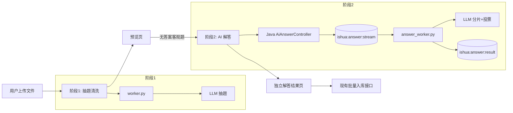
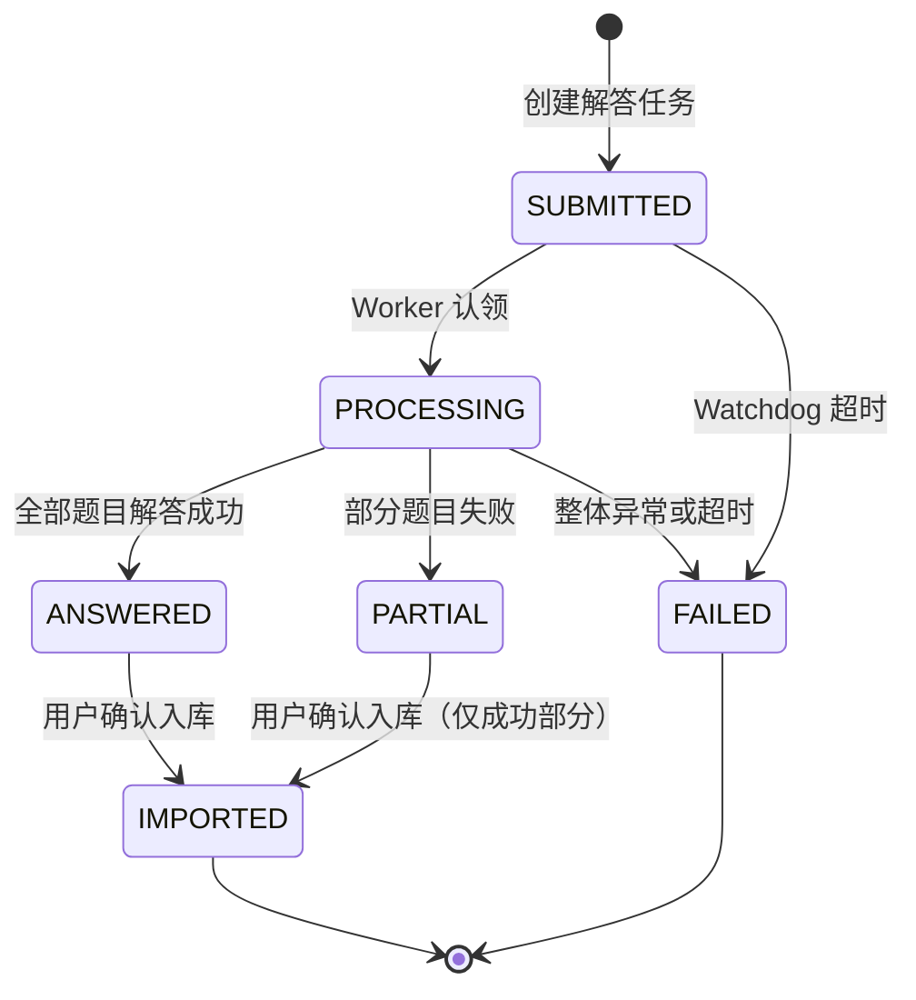
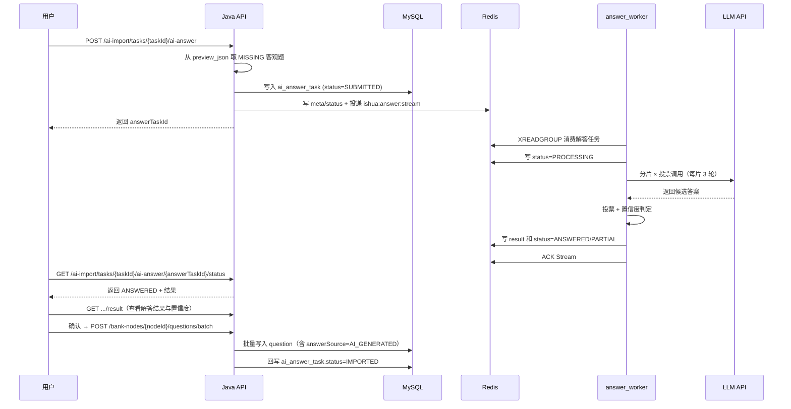

# AI 解答流程（AI Answer Flow）

iShua 在现有「AI 智能导题」基础上新增**两阶段 AI 流程**，用于解决题库文件本身不含答案时，LLM 在清洗的同时强行写答案导致错误率过高的问题。

- **阶段 1（抽题清洗）**：改造现有导题流程，提示词改为「原文无答案则 LLM 不输出答案」，仅完成结构化清洗，不编造答案。
- **阶段 2（AI 解答）**：新增独立的 LLM 流程。用户在预览页核对后，若发现题目不含答案，可手动选择「AI 解答」；该流程通过**分片 + 多次投票**调用 LLM 以保证正确率，并输出置信度供用户二次确认。

两条流程物理隔离：独立 Redis Stream、独立消费组、独立提示词、独立 Python Worker 进程，互不影响线上现有导题链路。

> 阶段 2 当前仅支持 `SINGLE` / `MULTI` / `JUDGE` 三类客观题；`SHORT_ANSWER`（简答题）暂不支持 AI 解答，保持「无答案」状态由用户手填。

---

## 参与组件

| 组件 | 阶段 1 职责 | 阶段 2 职责 |
| --- | --- | --- |
| 前端 | 预览页展示「无答案」标签 | 触发「AI 解答」、轮询、展示解答结果与置信度 |
| Spring Boot API | 透传 `answerSource` 字段 | 新增 `AiAnswerController`，创建/查询解答任务 |
| Redis Stream | `ishua:task:stream`（不变） | 新增 `ishua:answer:stream` |
| Python Worker | 现有 `worker.py`（仅改 prompt + 校验） | 新增 `answer_worker.py`（独立进程） |
| LLM API | 抽题清洗（现有模型） | 分片 + 投票解答（可换更强模型） |
| MySQL | `question` 表新增 `answer_source` / `answer_confidence` 列 | 新增 `ai_answer_task` 表 |

---

## 总体架构



---

## 阶段 1：抽题清洗流程改造

### 1.1 核心思路

维持现有 MinerU + LLM 抽题流程不变，仅修改：

1. 提示词：原文无答案时，LLM 输出 `answer: []` 且 `answerSource: "MISSING"`，**禁止编造答案**。
2. Python 校验：允许 `answer` 为空数组（仅在 `answerSource=MISSING` 时）。
3. 数据结构：`QuestionPreviewVO` 与 `question` 表新增 `answerSource` / `answerConfidence` 字段。

### 1.2 提示词变更

新增 `ai-import-worker/prompts/ai-import-system-v4.txt`（基于现有 v3 修改）：

| v3 规则 | v4 规则 |
| --- | --- |
| `answer 必须为非空字符串数组；禁止用空数组 []` | `原文无答案时必须输出 answer: []`，禁止编造答案 |
| `无答案时：SINGLE/MULTI 用 answer: ["A"]；JUDGE 用 ["T"]；SHORT_ANSWER 用 ["（待补充）"]` | 删除占位规则。改为：无答案时 `answer: []` 且 `answerSource: "MISSING"` |
| 5 个键固定（questionType/stem/options/answer/analysis） | 6 个键：新增 `answerSource`（枚举 `ORIGINAL` / `MISSING`） |
| — | 有答案时 `answerSource: "ORIGINAL"` |

`.env` 切换：

```
LLM_SYSTEM_PROMPT_PATH=prompts/ai-import-system-v4.txt
```

### 1.3 Python 校验放宽

`ai-import-worker/llm_client.py` 的 `_validate_llm_shape`：

- 允许 `answer == []`，但要求此时 `answerSource == "MISSING"`。
- `answerSource` 缺省视为 `ORIGINAL`，此时 answer 仍须非空（兼容历史提示词）。
- 新增 `answerSource` 取值校验（仅允许 `ORIGINAL` / `MISSING`）。

`ai-import-worker/question_preview.py` 的 `to_preview_vo`：

- MISSING 题保留 `answer: []`，不再丢弃（当前会因 answer 为空被丢弃）。
- 透传 `answerSource` 字段到 preview VO。

### 1.4 Java VO 与实体扩展

#### `QuestionPreviewVO`

新增字段：

| 字段 | 类型 | 取值 | 说明 |
| --- | --- | --- | --- |
| `answerSource` | `String` | `ORIGINAL` / `MISSING` / `AI_GENERATED` | 答案来源，默认 `ORIGINAL`（兼容历史数据） |
| `answerConfidence` | `String` | `HIGH` / `MEDIUM` / `LOW` / `null` | 答案置信度，阶段 1 始终为 `null` |

`LlmQuestionParseDTO` 同步增加字段。

#### `Question` 实体

新增字段 `answerSource` / `answerConfidence`，`QuestionServiceImpl.batchImportPreview` 透传。

### 1.5 DDL 迁移

新增 `sql/schema/question_add_answer_source.sql`：

```sql
ALTER TABLE question
  ADD COLUMN answer_source VARCHAR(16) NULL DEFAULT 'ORIGINAL'
    COMMENT '答案来源: ORIGINAL/MISSING/AI_GENERATED' AFTER answer_json,
  ADD COLUMN answer_confidence VARCHAR(16) NULL DEFAULT NULL
    COMMENT '答案置信度: HIGH/MEDIUM/LOW' AFTER answer_source;
```

### 1.6 兼容性

| 项 | 处理 |
| --- | --- |
| 历史 `question` 表数据 | `answer_source` 默认 `ORIGINAL`，`answer_confidence` 默认 NULL，无需回填 |
| 历史 `ai_import_task.preview_json` | 反序列化时 `answerSource` 缺省视为 `ORIGINAL`，兼容 |
| 旧提示词回滚 | 改 `.env` 的 `LLM_SYSTEM_PROMPT_PATH` 即可切回 v3 |

---

## 阶段 2：AI 解答独立流程

### 2.1 范围与策略

- **支持题型**：`SINGLE` / `MULTI` / `JUDGE`。
- **不支持题型**：`SHORT_ANSWER`。简答题即使无答案也不进入 AI 解答流程，由用户在预览页手填。
- **核心算法**：分片 + 多次投票，分片大小与投票轮数均可通过环境变量配置。

### 2.2 数据模型

#### 新表 `ai_answer_task`

```sql
CREATE TABLE ai_answer_task (
  id              BIGINT PRIMARY KEY AUTO_INCREMENT,
  answer_task_id  VARCHAR(64) NOT NULL COMMENT '业务任务 ID',
  parent_task_id  VARCHAR(64) NOT NULL COMMENT '关联 ai_import_task.task_id',
  user_id         BIGINT NOT NULL,
  bank_id         BIGINT NOT NULL,
  question_count  INT NOT NULL COMMENT '待解答题数（仅客观题）',
  answered_count  INT DEFAULT 0 COMMENT '成功解答数',
  status          VARCHAR(16) NOT NULL COMMENT 'SUBMITTED/PROCESSING/ANSWERED/PARTIAL/FAILED/IMPORTED',
  answered_json   LONGTEXT NULL COMMENT '解答结果 QuestionPreviewVO[]',
  error_message   VARCHAR(500) NULL,
  llm_duration_ms INT NULL COMMENT 'LLM 总耗时',
  total_calls     INT NULL COMMENT '总 LLM 调用次数（分片×投票）',
  submitted_at    DATETIME NOT NULL,
  answered_at     DATETIME NULL,
  imported_at     DATETIME NULL,
  create_time     DATETIME DEFAULT CURRENT_TIMESTAMP,
  update_time     DATETIME DEFAULT CURRENT_TIMESTAMP ON UPDATE CURRENT_TIMESTAMP,
  is_deleted      TINYINT DEFAULT 0,
  UNIQUE KEY uk_answer_task_id (answer_task_id, is_deleted),
  KEY idx_parent (parent_task_id, is_deleted),
  KEY idx_user_status (user_id, status, submitted_at, is_deleted)
);
```

#### Redis Key（扩展 `IShuaRedisCacheConstants.java`）

| Key | TTL | 用途 |
| --- | --- | --- |
| `ishua:answer:stream` | — | 解答任务 Stream（独立） |
| `ishua:answer:group` = `ishua-answer-workers` | — | 独立消费组 |
| `ishua:answer:status:{id}` | 1h | 状态 |
| `ishua:answer:result:{id}` | 30min | 结果 JSON |
| `ishua:answer:meta:{id}` | 1h | 元数据 |
| `ishua:answer:import_lock:{id}` | 5min/24h | 入库幂等 |
| `ishua:answer:watchdog:lock` | 短 TTL | Watchdog 扫描锁 |

### 2.3 状态机



状态说明：

| 状态 | 说明 |
| --- | --- |
| `SUBMITTED` | Java API 已创建任务并投递 Stream |
| `PROCESSING` | Worker 正在解答 |
| `ANSWERED` | 全部题目解答成功，等待用户确认 |
| `PARTIAL` | 部分题目解答失败，已成功部分可入库 |
| `FAILED` | 整体失败或任务超时 |
| `IMPORTED` | 用户已确认入库（走现有批量入库接口后回写） |

### 2.4 Java 后端新增

#### Controller：`AiAnswerController`（新文件）

路径前缀 `/api/v1/ai-import/tasks/{taskId}/ai-answer`，角色 `PREMIUM`：

| Method | Path | 说明 |
| --- | --- | --- |
| POST | `` | 创建解答任务。请求体：`{questionIndices:[0,3,5]}` 或 `{filter:"MISSING"}`。从 `ai_import_task.preview_json` 取题，**仅筛选 SINGLE/MULTI/JUDGE 的 MISSING 题**，写表 + 投递 Stream，返回 `answerTaskId`。 |
| GET | `/{answerTaskId}/status` | 轮询解答进度。优先 MySQL，Redis 兜底。 |
| GET | `/{answerTaskId}/result` | 获取解答结果列表（带 `answerSource=AI_GENERATED` + `answerConfidence`），供前端二次确认。 |

入库仍走现有 `POST /api/v1/bank-nodes/{nodeId}/questions/batch`：前端把解答结果合并到原 preview 后提交，`BatchImportRequestDTO` 已接受 `List<QuestionPreviewVO>`，扩展字段透传即可。

#### Service 层（镜像现有 `AiImportTaskService` 设计）

| 类 | 职责 |
| --- | --- |
| `AiAnswerService` / `AiAnswerServiceImpl` | 任务创建、状态查询、结果获取 |
| `AiAnswerTaskService` / `AiAnswerTaskServiceImpl` | MySQL CRUD，复用 `AiImportTaskServiceImpl` 的状态机模式 |
| `AiAnswerTaskMetaStore` | R/W `ishua:answer:meta:{id}` |
| `AiAnswerTaskStatusStore` | R/W `ishua:answer:status:{id}`，含终态 CAS 保护 |
| `AiAnswerResultStore` | R/W `ishua:answer:result:{id}` |
| `AiAnswerStreamTaskDispatcher` | 投递到 `ishua:answer:stream` |
| `AiAnswerTaskWatchdog` | `@Scheduled` 扫描超时 `PROCESSING` 任务标记 FAILED |
| `AiAnswerTaskRedisSyncJob` | `@Scheduled` 把 Redis 状态同步回 MySQL |

以上 6 个 `service/ai/` 类结构照搬现有同类，只换 Key 前缀与 Stream 名。

### 2.5 Python Worker 新增（阶段 2 核心）

#### 新文件结构

```
ai-import-worker/
├── answer_worker.py         # 新：独立进程入口
├── answer_generator.py      # 新：分片 + 投票逻辑
├── answer_redis_manager.py  # 新：answer 流专用 Redis 管理（可继承现有 RedisManager）
├── prompts/
│   └── ai-answer-system.txt # 新：解答专用 prompt
└── (复用) config.py / llm_client.py
```

启动命令（与现有 `python -m main` 完全独立）：

```bash
python -m answer_worker
```

#### `answer_generator.py` 核心算法

```python
class AnswerGenerator:
    SHARD_SIZE = 10         # 可配，默认 10（环境变量 ANSWER_SHARD_SIZE）
    VOTE_ROUNDS = 3         # 可配，默认 3（环境变量 ANSWER_VOTE_ROUNDS）
    TEMPERATURE = 0.4       # 投票时引入多样性

    def generate(self, questions: List[Dict]) -> List[Dict]:
        # 仅含 SINGLE/MULTI/JUDGE
        shards = chunk(questions, self.SHARD_SIZE)
        results = parallel_map(
            self._answer_shard, shards,
            max_workers=settings.answer_max_concurrency,
        )
        return flatten(results)

    def _answer_shard(self, shard: List[Dict]) -> List[Dict]:
        # 多轮调用（temperature>0），每轮独立采样
        candidates = [
            self._call_llm(shard, temperature=self.TEMPERATURE)
            for _ in range(self.VOTE_ROUNDS)
        ]
        # 逐题投票
        return [
            self._vote(shard[i], [c[i] for c in candidates])
            for i in range(len(shard))
        ]

    def _vote(self, question, candidates):
        q_type = question["questionType"]
        if q_type in {"SINGLE", "JUDGE"}:
            return self._vote_single_or_judge(question, candidates)
        else:  # MULTI
            return self._vote_multi(question, candidates)
```

#### 置信度规则

| 题型 | HIGH | MEDIUM | LOW |
| --- | --- | --- | --- |
| `SINGLE` / `JUDGE` | 3/3 一致 | 2/3 一致 | 无多数（取众数，analysis 标 `【AI解答·存疑】`） |
| `MULTI` | 全部字母 3/3 出现 | 部分字母 2/3 出现 | 无字母达 2/3（answer 仍取出现≥2 次的，标存疑） |

LOW 置信度题仍返回答案，前端高亮提醒用户必看，由用户决定是否采用。

#### `prompts/ai-answer-system.txt` 要点

- 角色：「高准确率客观题答题引擎」，只回答给定题目的答案，**禁止改写题干/选项**。
- 输入：一个 shard（≤10 题，含 `questionType` / `stem` / `options`）。
- 输出：JSON 数组，每题 `{index, answer, analysisBrief}`。
- `SINGLE`：answer 恰好 1 个字母；`JUDGE`：`["T"]` / `["F"]`；`MULTI`：升序多字母。
- 禁止说「无法解答」；置信度由 Python 投票逻辑决定，不让 LLM 自评。

### 2.6 配置项扩展（`config.py`）

以下环境变量均可调，**分片大小与投票轮数默认值为 10 和 3**：

| 环境变量 | 默认值 | 说明 |
| --- | --- | --- |
| `ANSWER_REDIS_STREAM` | `ishua:answer:stream` | 解答任务 Stream |
| `ANSWER_REDIS_GROUP` | `ishua-answer-workers` | 解答任务消费组 |
| `ANSWER_SHARD_SIZE` | `10` | 每片题目数，影响单次 prompt 长度与成本 |
| `ANSWER_VOTE_ROUNDS` | `3` | 每片投票轮数，影响正确率与成本 |
| `ANSWER_TEMPERATURE` | `0.4` | 投票时采样温度，引入多样性 |
| `ANSWER_LLM_MODEL` | 同 `LLM_MODEL` | 解答专用模型，可换更强模型（如 `deepseek-reasoner`） |
| `ANSWER_MAX_CONCURRENCY` | `4` | shard 并发数 |
| `ANSWER_SKIP_SHORT_ANSWER` | `true` | 是否跳过简答题（已确认不支持） |
| `ANSWER_LLM_TIMEOUT_SECONDS` | `120` | 解答 LLM 单次调用超时 |

成本估算：N 道客观题、分片 10、投票 3 → 总调用次数 ≈ `ceil(N/10) × 3`。20 题约 6 次调用。

### 2.7 端到端流程



### 2.8 失败隔离与可观测

- **分片失败不阻塞整批**：某片 LLM 调用失败时，该片中题目以 `answer=[]`、`answerSource=MISSING`、analysis 标 `【AI解答·失败】` 返回，其余片正常解答；任务整体状态为 `PARTIAL`。
- **可观测字段**：`ai_answer_task.total_calls`（总调用次数）、`answered_count`（成功数）、`llm_duration_ms`（总耗时），用于监控成本与质量。
- **重试**：`PARTIAL` 状态下用户可对失败题目再次触发 AI 解答（创建新的 `ai_answer_task`）。

---

## 准确率与成本控制

| 措施 | 作用 |
| --- | --- |
| 分片（默认 10 题/片） | 降低单次 prompt 长度，LLM 注意力更集中，降低串题/漏题 |
| 多次投票（默认 3 轮） | 独立样本多数表决，显著优于单次 greedy |
| 置信度透传 | LOW 题前端高亮，降低错误流入正式库概率 |
| 失败隔离 | 单片失败不阻塞整批 |
| 可配置参数 | `ANSWER_SHARD_SIZE` / `ANSWER_VOTE_ROUNDS` 可按场景调优 |
| 独立模型 | `ANSWER_LLM_MODEL` 可用更强模型，与抽题模型解耦 |

---

## 迁移与兼容

| 项 | 处理 |
| --- | --- |
| 历史 `question` 表数据 | `answer_source` 默认 `ORIGINAL`，`answer_confidence` 默认 NULL，无需回填 |
| 历史 `ai_import_task.preview_json` | 反序列化时 `answerSource` 缺省视为 `ORIGINAL`，兼容 |
| 旧 Worker 不识别 answer Stream | 物理隔离的 Stream/Group，旧 `worker.py` 不会消费，可独立部署/灰度 |
| 阶段 1 prompt 回滚 | 改 `.env` 的 `LLM_SYSTEM_PROMPT_PATH` 即可切回 v3 |
| 阶段 2 灰度 | `answer_worker` 独立进程，可单独启停；前端「AI 解答」按钮可加 feature flag |

---

## 测试方案

### 阶段 1

- 单测：`question_preview.to_preview_vo` 对 `answer=[]` + `answerSource=MISSING` 透传；对缺省 `answerSource` 兼容为 `ORIGINAL`。
- 单测：`llm_client._validate_llm_shape` 允许 MISSING 题空 answer，拒绝 ORIGINAL 题空 answer。

### 阶段 2

- 准备 20 道已知答案的客观题（去掉原答案），跑解答任务，对比正确率（目标：客观题 ≥ 90%）。
- 故意注入 1 道无解题（选项不全），验证 LOW 置信度标记与不阻塞其他题。
- 验证 `SHORT_ANSWER` 题不进入解答流程。
- 并发测试：同时投递多个解答任务，验证 Stream 消费与状态隔离。
- 参数调优：分别用 `ANSWER_SHARD_SIZE=5/10`、`ANSWER_VOTE_ROUNDS=3/5` 跑同一批题，对比正确率与成本。

### 端到端

从上传到入库全链路走一遍：上传 → 阶段 1 抽题（含无答案题）→ 预览 → AI 解答 → 结果确认 → 批量入库 → 校验 `question` 表 `answer_source=AI_GENERATED`。

---

## 关键代码导航（实施后补充）

| 能力 | 代码位置 |
| --- | --- |
| 阶段 1 提示词 | `ai-import-worker/prompts/ai-import-system-v4.txt` |
| 阶段 1 Python 校验 | `ai-import-worker/llm_client.py` / `question_preview.py` |
| 阶段 1 Java VO | `src/main/java/.../vo/ai/QuestionPreviewVO.java` |
| 阶段 1 DDL | `sql/schema/question_add_answer_source.sql` |
| 阶段 2 Java Controller | `src/main/java/.../controller/AiAnswerController.java` |
| 阶段 2 Java Service | `src/main/java/.../service/ai/AiAnswer*.java` |
| 阶段 2 Python Worker | `ai-import-worker/answer_worker.py` |
| 阶段 2 解答算法 | `ai-import-worker/answer_generator.py` |
| 阶段 2 解答提示词 | `ai-import-worker/prompts/ai-answer-system.txt` |
| 阶段 2 DDL | `sql/schema/ai_answer_task.sql` |
